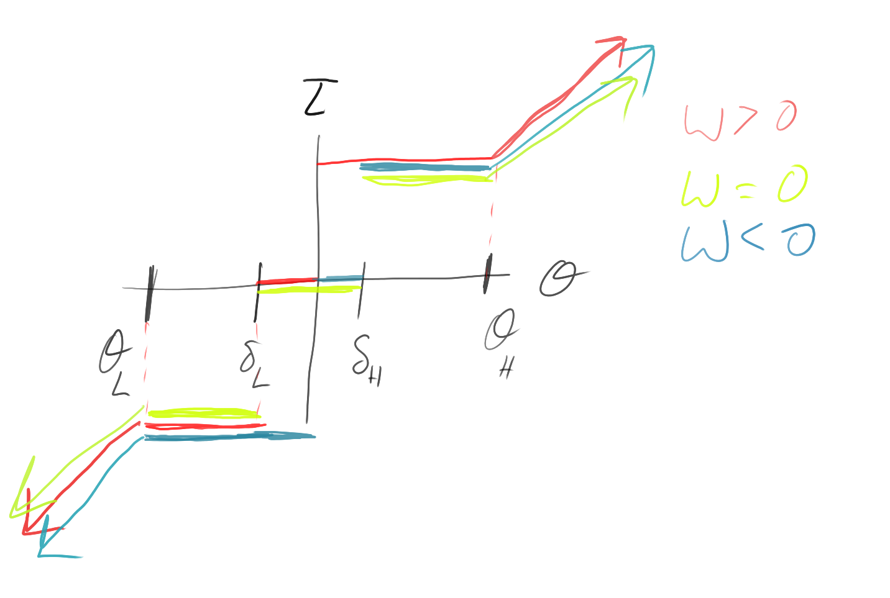

Friction Compensators
=====================


## Hysteresis Stick-Slip (HSS) Friction Compensator



### Usage

This compensator is suitable for use with joint-space control schemes with a
desired joint-space position.  It's provided as a simple library class and
member function call.

Each compensator requires 5 parameters:

* The linear proportional gain used for this joint outside of the static
  friction region.
* Lower and upper static efforts. These are the constant torques or forces
  which will be applied within the displacement offsets of the goal position.
  These are the `T_s-` and `T_s+` in the  model below.
* Lower and upper deadbands to be applied depending on the sign of the velocity
  to prevent limit cycles.  These are the `d_L` and `d_H` in the  model below.

```cpp
// Create a 1D joint friction compensator with asymmetric parameters
lcsr_controllers::friction::JointFrictionCompensatorHSS stickslip(
  linear_p_gain,
  static_effort_low, 
  static_effort_high,
  deadband_low, 
  deadband_high)
```

In the case where these parameters are symmetric, you can just specify one of
each, as shown below:

```cpp
// Create a 1D joint friction compensator with symmetric parameters
lcsr_controllers::JointFrictionCompensatorHSS stickslip(
  linear_p_gain,
  static_displacement,
  static_effort,
  deadband)
```

Then, you can compute the nonlinear proportional gain ith the following call:

```cpp
// Compute the nonlinear proportional command term during the control update
p_term_nonlinear = stickslip.compensate(
  joint_position_desired,
  joint_position,
  joint_velocity);

```

### Model

This controller compensates for a simple stick-slip friction model described in
Secion III-B in [bona2005friction] and as the sole subject of [kang1998robust].
That model and the compensation control laws are summarized below:

Specifically, it assumes a Karnopp model for the friction on each joint:

```
            /  t_s+:     0  < t_s+ <  t_c
t_stick =  {    t_c:  t_s- <= t_c  <= t_s+
            \  t_s-:   t_c  < t_s- <  0

t_slip = t_d+*mu + t_d-*mu
```

Where `t_c` is the command torque, `t_s+` and `t_s-` are the limits of the
static friction torque. Also, `t_d+` and `t_d-` are the slipping torque
functions for positive and negative velocities (bound in the first and third
quadrants), and mu is the right-continuous Heaviside step function. Note
`t_slip`, `t_d+`, `t_d-`, and `mu` are all functions of `dq/dt`.

The effect of this is that, when uncompensated, all PD control leads to a
steady-state position error such that for some desired joint position `q_d`,
the joint position `q` is in some region:

```
q_d + q_L <= q <= q_d + q_H

0 > q_L = -t_s+ / K_P
0 < q_H = -t_s+ / K_P
```

Henceforth, we will consider `q_d = 0` without loss of generality.

The error due to friction is then eliminated by using a nonlinear proportional
compensation torque, `t_n` defined as follows. Note in the reference
literature, this is given in the context of a joint-space PD control law:

```

t_c = -K_d*dq/dt - t_n

       /  -t_~s-:      0 < q <= q_~H
t_n = {        0:          q = 0
       \  -t_~s+:  q_~L <= q <= 0
        \  K_P*q: otherwise

eps > 0
q_~H = q_H + eps
q_~L = q_L - eps
t_~s+ = -K_P * q_~L = t_s+ + K_P*eps
t_~s- = -K_P * q_~H = t_s- - K_P*eps
```

This is further augmented by [kang1998robust] in order to take into account
instability issues induced by the time delay involved in sampling when
performing digital control. Without this augmentation, the above control law
would exhibit limit cycles.

The augmentation involves considering hysteresis effects for different velocity
regions. 

When `dq/dt > 0`:
```
       /  -t_~s-:      0 < q <= q_~H
t_n = {        0:   d_L <= q <= 0
       \  -t_~s+:  q_~L <= q <= d_L
        \  K_P*q: otherwise
```
When `dq/dt < 0`: (note kang1998robust has a typo for this one)
```
       /  -t_~s-:    d_H < q <= q_~H
t_n = {        0:     0 <= q <= d_H
       \  -t_~s+:  q_~L <= q <= 0
        \  K_P*q: otherwise
```
When `dq/dt = 0`:
```
       /  -t_~s-:    d_H < q <= q_~H
t_n = {        0:   d_L <= q <= d_H
       \  -t_~s+:  q_~L <= q <= d_L
        \  K_P*q: otherwise
```

Where `d_L` and `d_H` define the velocity-dependent deadzones such that 
`q_~L < d_L` and `d_H < q_-H`.

**[kang1998robust]** *Kang, M. S., "Robust digital friction compensation," pp.
359-367, Control Engineering Practice Vol. 6, 1998.* 

**[bona2005friction]** *Bona, B., Indri M., "Friction Compensation in Robotics: an
Overview," Proceedings of the 44th IEEE Conference on Decision and Control, and
the European Control Conference 2005.*
